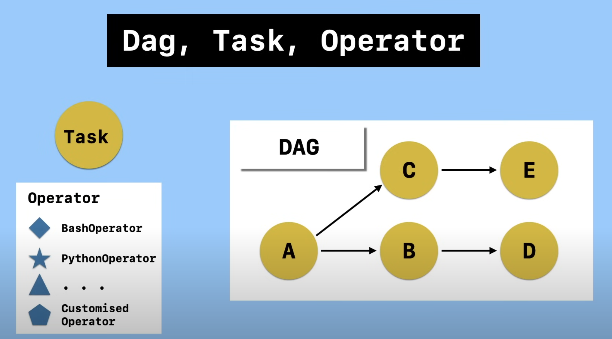
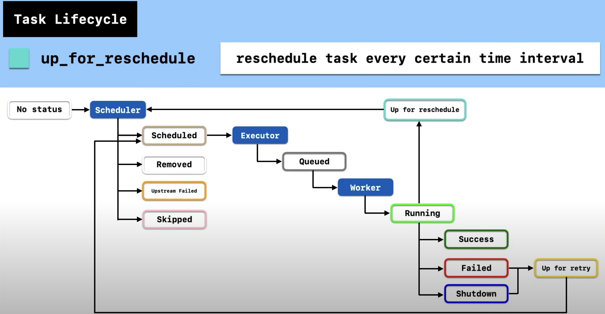

# Airflow

- Airflow is platform to manage complex workflows (see Figure 1.0 of DAG components)
- Workflows are DAGs (directed acyclic graphs) and consists of Tasks.
- Tasks performs operators which consists of BashOperator, PythonOperator, CustomizedOperator, etc.
- Operators can leverage Hooks to conneect and perform actions on external systems

# Execution and Task Lifecycle

- Once DAGs are scheduled and finally executed, tasks are orchestrated to execute one after another according to their dependencies but this doesn't mean DAGs are synchronous (see Figure 1.0 how A triggers C and B asynchronously) and can be categorized into three groups (scheduler stages, worker stages, and executor stages)
- The task lifecycle are scheduled to go through 11 different stages (see Figure 1.01):
  - Scheduler stages
    - **no_status** - scheduler created an empty task instance
    - **scheduled** - scheduler created a task instance to execute and can encounter statuses such as _skipped_, _removed_, or _upstream_failed_
      - **upstream_failed** - current task's upstream failed and cannot run (see Figure 1.0 if A fails then B encounters upstream fail)
  - Executor stages
    - **queued** - scheduler sent task to executor to run and wait for when a worker is available (worker is when the computation resource is not occuppied)
  - Worker stages
    - **running** - removes from queue and runs after a worker is assigned, which can encounter _success_, _failed_ or _shutdown_
      - **up_for_retry** - if a task fails or shutdown, it will retry the entire lifestyle

# User of Airflow

- Typically, data engineers manages Airflow to maintain the following:
  - configurations in airflow.cfg
  - authoring and maintaining DAGs
  - navigating through airflow UI hosted in webserver (typically Docker) to manage DAGs, schedulers, executors, and workers which are all connected to some DB such as postgres, MySQL, etc.

# useful commands

- airflow running in docker
  - to set-up
    1. `docker --version`
    2. `docker-compose --version`
    3. curls for [airflow docker yaml](https://airflow.apache.org/docs/apache-airflow/stable/howto/docker-compose/index.html)
    4. `mkdir -p ./dags ./logs ./plugins ./config`
    5. `docker-compose up airflow-init`
    6. `docker-compose up -d`
    7. `docker ps` to see running containers
  - to launch airflow and its container
    1. `docker-compose up airflow-init`
    2. `docker-compose up -d`
  - to shutdown airflow and its container
    1. `docker-compose down -v`
